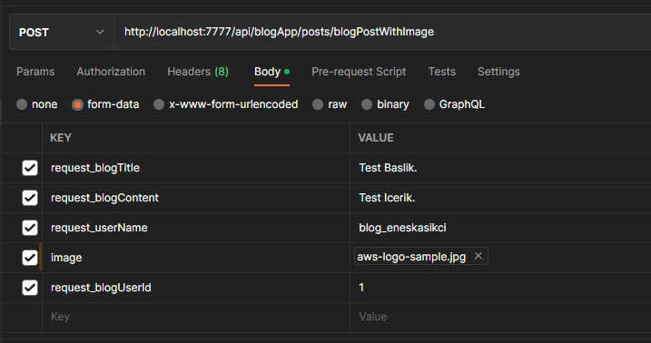
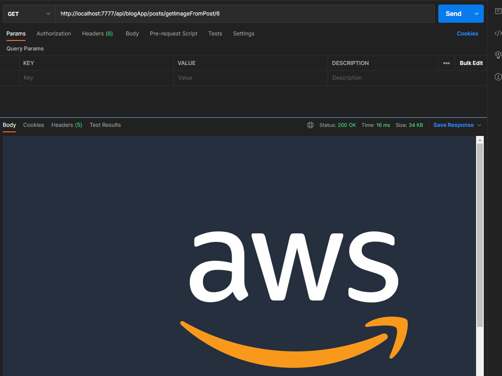

# Introduction

This is the Blog Application part of the Techcareer / Airties Cloud SW Bootcamp Graduation projects.

Using Rest API, Spring Boot, H2 Database, Docker.

The app is running in H2 Database by default, but there is a MYSQL connection details in the application.properties.
To run it on MYSQL simply comment out the H2 database and uncomment the MYSQL connection details. 

# Docker Setup

Start the terminal in the project directory. Start the containers by "docker-compose up".

## Mappings
### POST Mappings for the Diary Application
#### createBlogUser: Creates a blog user for the database.
- http://localhost:7777/api/blogApp/users/createBlogUser

        {       
            "userName": "test"
        }
Creates a new blog user to the database. Later you can use this user to create a blog post locally. We only require username on this app because
we don't want to store any personal information about the user. Email and passwords are being stored in the Register Login App.

- http://localhost:5555/api/diaryApp/posts/createDiaryPost

        {       
            "request_blogTitle": "test",
            "request_blogContent": "test",
            "request_userName" : "test",
            "request_blogUserId" : 1
        }

This creates a post without Image. To create a new post you must provide the correct username and blogUserId. You can get these information from the getAllBlogAppUsers mapping.

- http://localhost:7777/api/blogApp/users/blogPostWithImage
   
    To create a blog post with Image, you must create it like this.
- 

This turns the image into a byte[] array and stores it in the database.

### GET Mappings
#### getAllPosts: List every blog that is on the database.
- http://localhost:7777/api/blogApp/posts/getAllPosts
- http://localhost:7777/api/blogApp/posts/getAllPosts?userId=X (X is the user id)

Used for getting the every post in the blog database. If you want to see the posts of a specific user, you can pass the userId parameter.

#### Listing posts by the given parameters.
#### To get the specific posts, you can use the parameters below.
- Lists posts from the user.
    - http://localhost:7777/api/blogApp/posts/getAllPostsFromUser/{userName}

      Ex. http://localhost:7777/api/blogApp/posts/getAllPostsFromUser/eneskasikci

      To see blog posts from the user with the given username. We are passing the username as a path variable.
      If the user doesn't exist, it will return null.

#### To see a specific post in the blog database.
- http://localhost:7777/api/blogApp/posts/{postId}

  Ex. http://localhost:7777/api/blogApp/posts/1

We are passing the postId. If the post doesn't exist, it will return null.
#### To see the image attached to the post.
- http://localhost:7777/api/blogApp/posts/getImageFromPost/{postId}

  Ex. http://localhost:7777/api/blogApp/posts/getImageFromPost/1

Result of the mapping.
  

### Delete Mappings
For deletion, you can use the parameters below.

#### To delete a specific post in the blog database of the given username.
- http://localhost:7777/api/blogApp/posts/deletePostIfUserIsOwner

        {
            "deletionrequest_userName" : "eneskasikci",
            "deletionrequest_blogId" : 1
        }

We are passing the delete request with the JSON body. If the username has a post with the given blogId, it will delete the blog post.
If the given username trying to delete a post that is not his, or the there are no post with the given postId, it will return a message accordingly.

#### To delete all the posts in the database.
- http://localhost:5555/api/diaryApp/posts/deletePosts

  This will delete every post in the database. Here for the testing purposes.

### Put Mappings
#### Update requests for the posts.
#### To update a specific post in the diary database.
- http://localhost:5555/api/diaryApp/posts/updatePost/{postId}

        {
            "request_blogUpdatedPostTitle": "updatedTitle",
            "request_blogUpdatedPostContent": "updatedContent"",
            "request_blogUpdatedPost_userName" : "eneskasikci"
        }

  We are passing the update request with the JSON body. If the username has a post with the given postId, it will update the post.
  If the given username trying to update a post that is not his, or the there are no post with the given postId, it will return a message accordingly.

#### To update post with the username.
- http://localhost:7777/api/blogApp/posts/updatePostIfUserIsOwner

        {
            "request_blogUpdatedPostTitle": "updatedTitle",
            "request_blogUpdatedPostContent": "updatedContent"",
            "request_blogUpdatedPost_userName" : "eneskasikci",
            "request_blogUpdatedPostId" : 1
        }

  This will update the post with the given username, and the postID. Made for the Register Login Gateway.
### Delete Mappings
#### To delete a specific post in the blog database of the given username.
- http://localhost:7777/api/blogApp/posts/deletePostIfUserIsOwner

        {
            "deletionrequest_userName" : "eneskasikci",
            "deletionrequest_blogId" : 1
        }

  We are passing the delete request with the JSON body. If the username has a post with the given blogId, it will delete the blog post.
  If the given username trying to delete a post that is not his, or the there are no post with the given postId, it will return a message accordingly.
